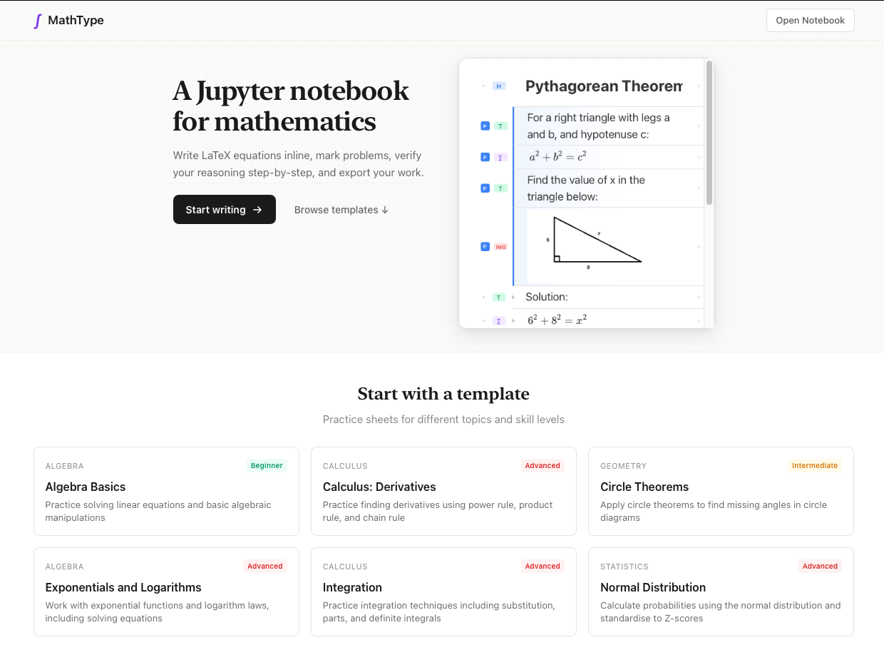
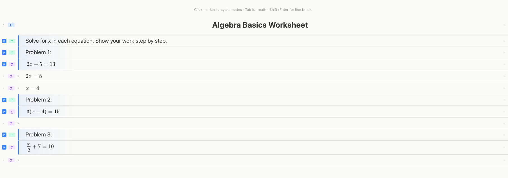
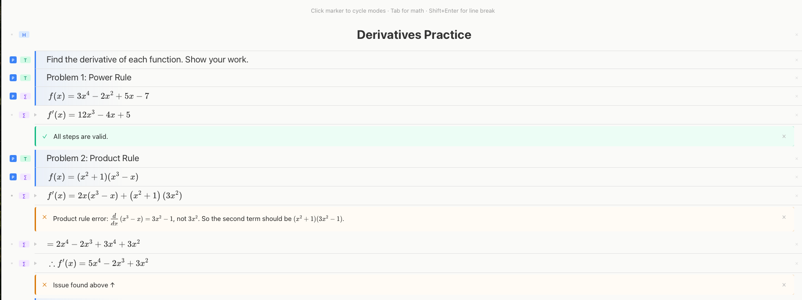

# MathType

A notebook app for maths. Write LaTeX inline, mark problem sections, and check your working.



## Features

- **Mixed content** - Headers, text, LaTeX equations, and images in one document
- **Problem marking** - Tag lines as "problem" vs "working" to keep track of what you're solving
- **Reasoning checker** - Hit the play button to validate your steps (uses Claude API)
- **Templates** - Pre-made worksheets for GCSE and A-Level topics
- **Import/Export** - Save and load notebooks as JSON





## Running locally

```bash
npm install
npm run dev
```

Needs a `.env` file with `OPENAI_API_KEY` if you want the reasoning checker to work.

## Tech

- Next.js 15
- [MathLive](https://cortexjs.io/mathlive/) for LaTeX rendering
- OpenAI GPT-5.2 for step verification

## Templates

Includes worksheets covering:
- Algebra (quadratics, simultaneous equations, surds)
- Geometry (Pythagoras, trig, circle theorems, vectors)
- Calculus (differentiation, integration)
- Statistics (probability trees, normal distribution)
- Mechanics (SUVAT equations)
